**The more I use the Corsair Galleon 100 SD Keyboard, the more I ❤️ it!!!**  

<!--more-->

---

>I have used a Stream Deck for many years. Integrating Stream Deck functionality directly into a keyboard is next level! 😎  

---

## **How to be productive with an advanced keyboard**

My blogs primarily cover automation and monitoring software. I have used two Stream Decks for several years to manage CLI text entry and product demos. This prevents errors during video production and live presentations. Corsair’s integrated Stream Deck keyboard replaces the standard numeric keypad, which eliminates the need to reach for external stream deck buttons. This integration supports my focus on automation by providing a consistent interface to execute apps, scripts and workflows.

The Corsair Galleon 100 SD replaces the numeric keypad with programmable stream deck keys, making automation more accessible. This hardware choice aligns with my goal of creating consistent, repeatable processes. It allows for the rapid deployment of workflows directly from the keyboard.

This product gets 👍🏻👍🏻👍🏻👍🏻 in my book!

---

## **Corsair Galleon 100 SD pics:**

**Full Keyboard:**  

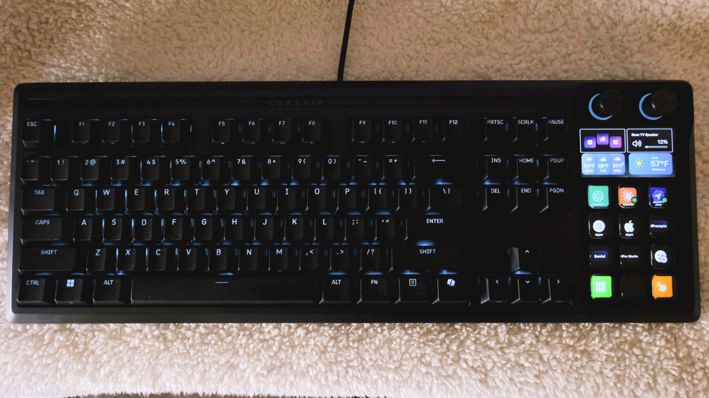  

---

**My Main Stream Deck Layout:**  

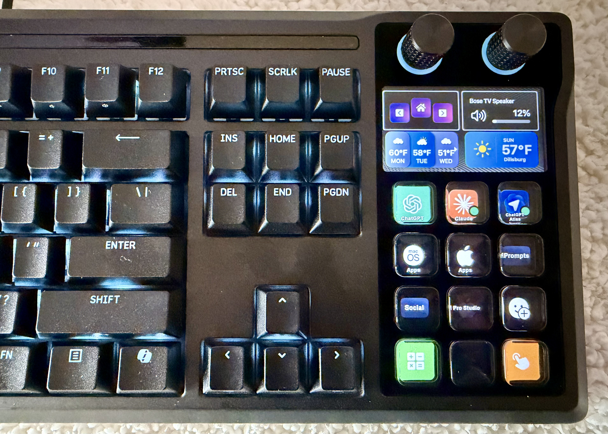  

---

**Apple Apps:**  

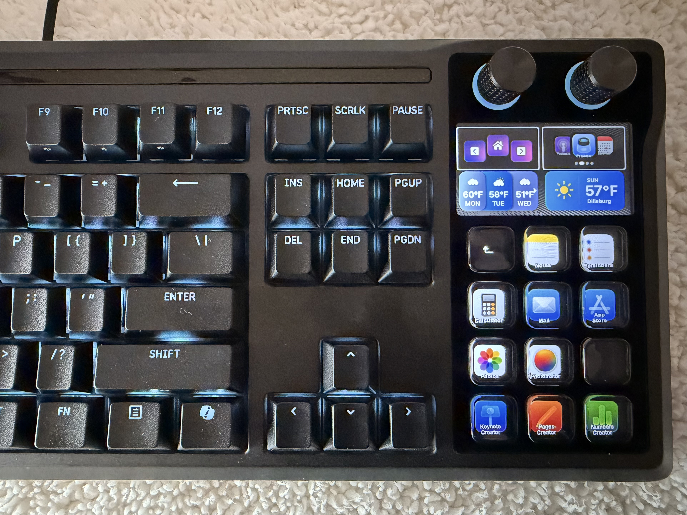  

---

**Misc Apps:** 

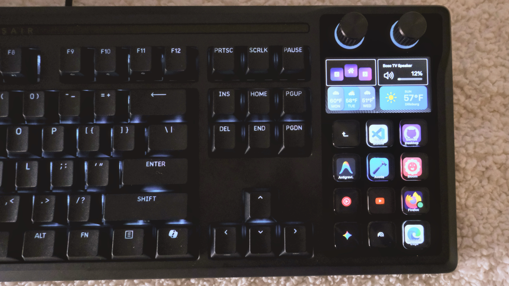  

---

**Page Layout Ideas for you to use:**

---

**Main Page:**  

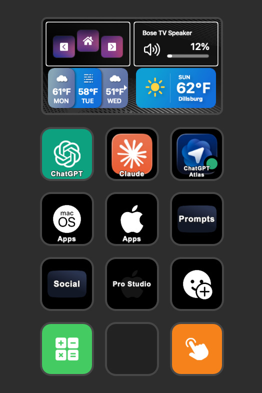  

---

**Apple Apps:** 

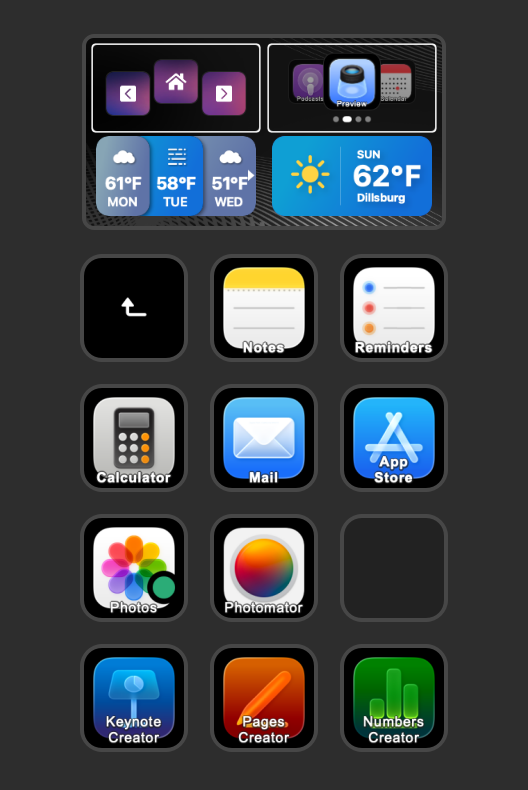  

---

**Misc Apps:**

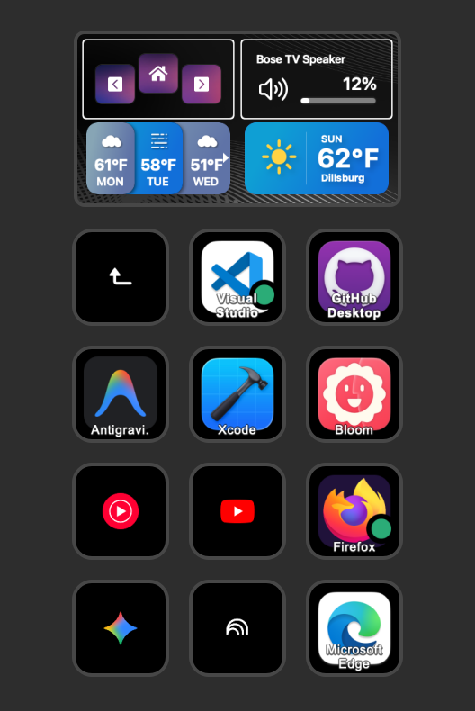  

---

**Social Media:**
- **Hugo buttons for cli commands**

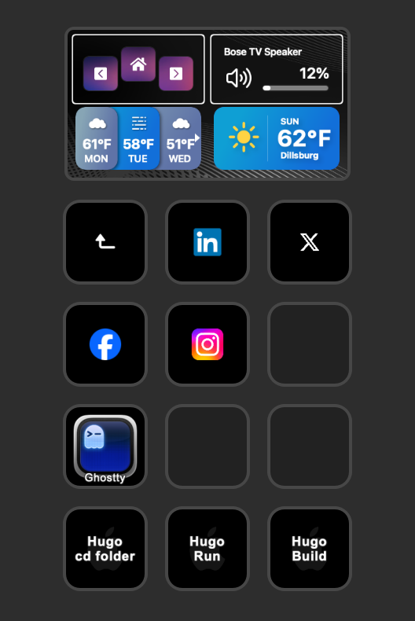  

---

**Apple Apps:**

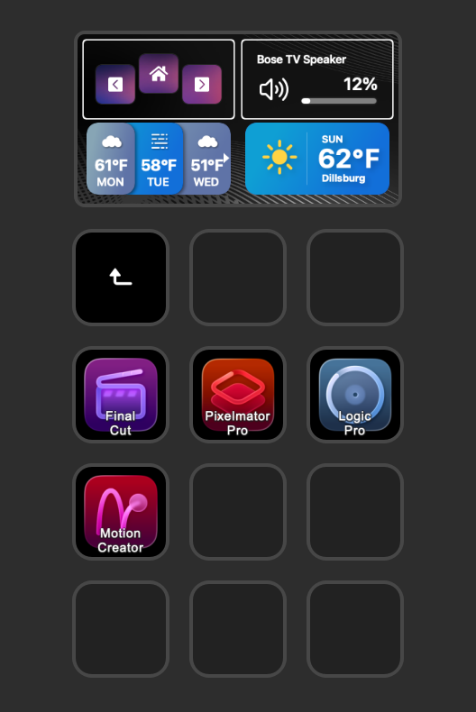  

---

**AI prompts:**

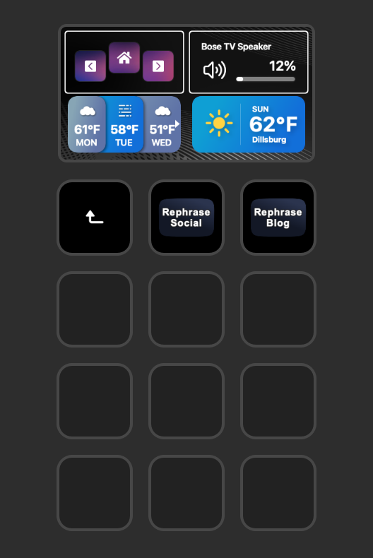  

---

**Numeric Keyboard:**  
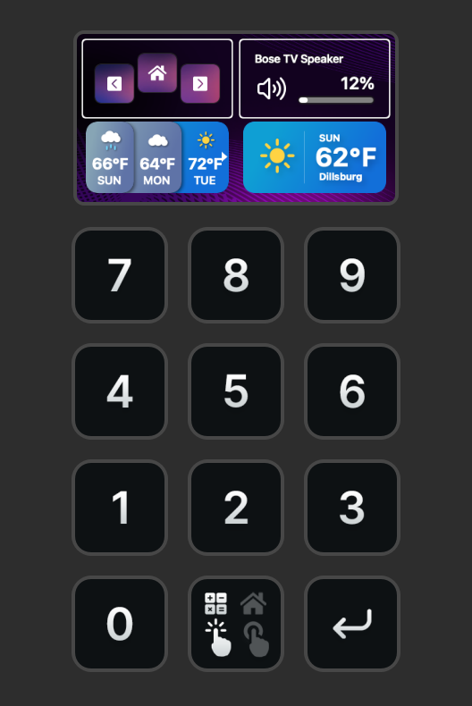  

---

**Most used emoji buttons:**  

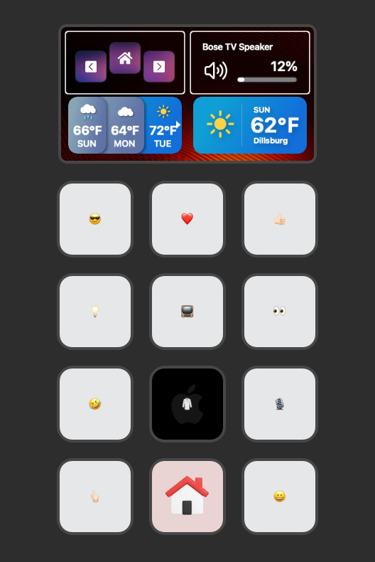  

---

- **Have button to manage window position on a screen and what screen to move the app to:**  
- **Lock the Computer:**  
- **Connect to a Bluetooth device:**  

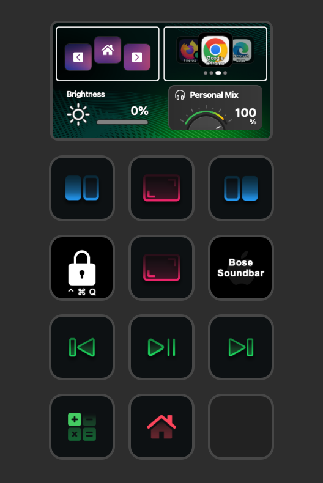

---

**You can turn the keyboard knob to choice an App to launch:**  
- Press the Knob to open the App.

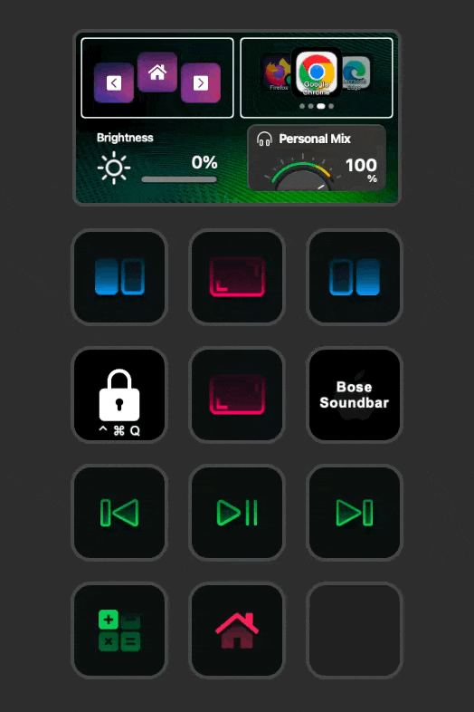

---

**The Stream Deck ecosystem includes both hardware and on-screen virtual components. Both interfaces can be used simultaneously to manage tasks.:**  
- The virtual interface provides access to Stream Deck functions while traveling. This allows for consistent workflows without the physical keyboard.  

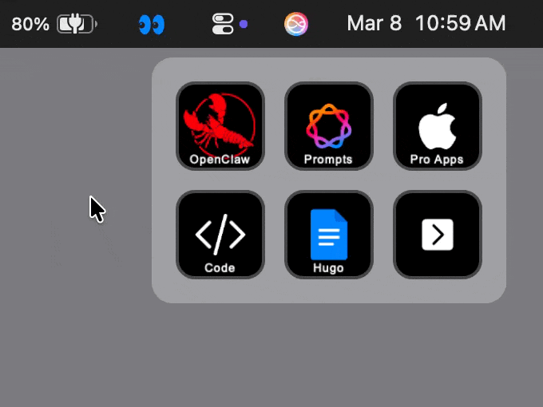

---

## **Key Takeaways:**

- Integrating this keyboard into my setup is a financial investment in my productivity. Similar to hardware upgrades for a home lab, this purchase supports long-term personal development.  
- My setup includes both physical keyboard buttons and usage of the on-screen virtual stream deck interface. This dual-input approach optimizes task management.  
- Hands down, best keyboard ever built!  
- [Click to the GALLEON 100 SD web site](https://www.corsair.com/us/en/p/keyboards/CH-912A31I-NA/galleon-100-sd-stream-deck-integrated-mechanical-keyboard-ch-912a31i-na)
- I picked up my GALLEON 100 SD at a Micro Center Store.

---

* If you found this blog article helpful and it assisted you, consider buying me a coffee to kickstart my day.  

---
